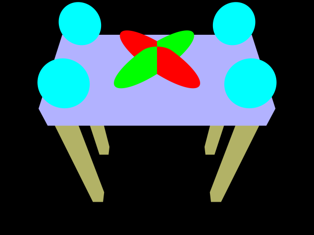
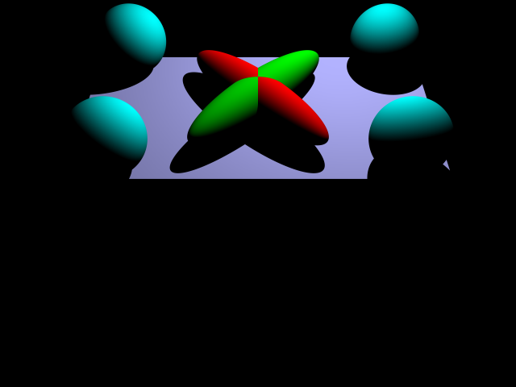
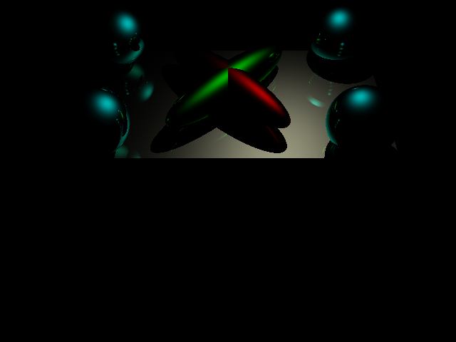
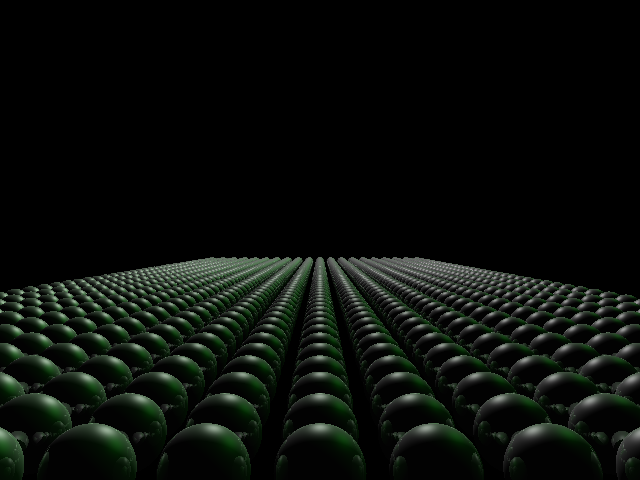
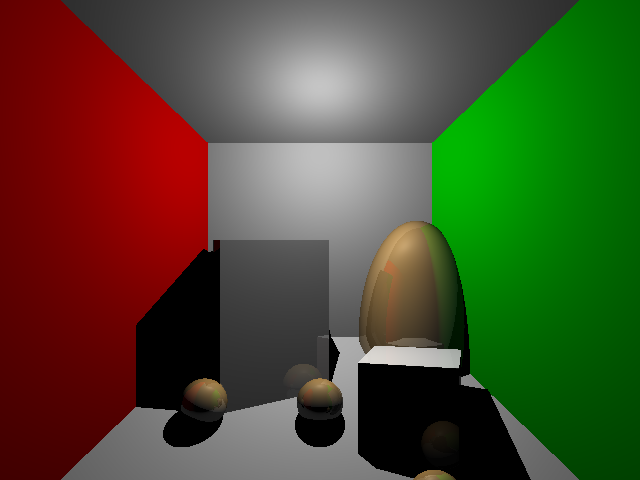
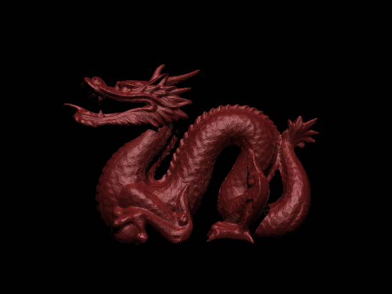

# 167-ec-pics
"Webpage" to put extra credit picture for CSE167
The left side is image produced before anti-aliasing, the right side the image with anti-aliasing.

  
  

  
  

  
  

  
  

  
  

  
  

  
  

